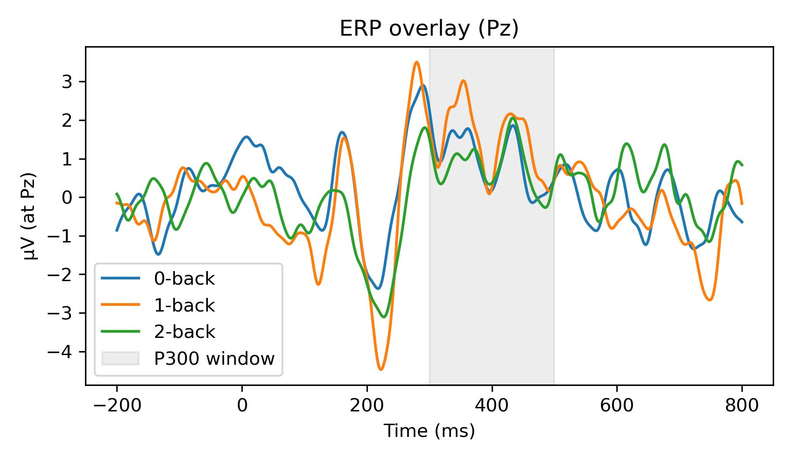
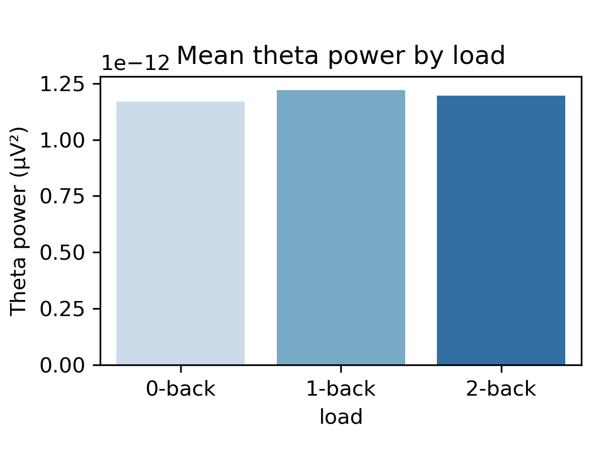
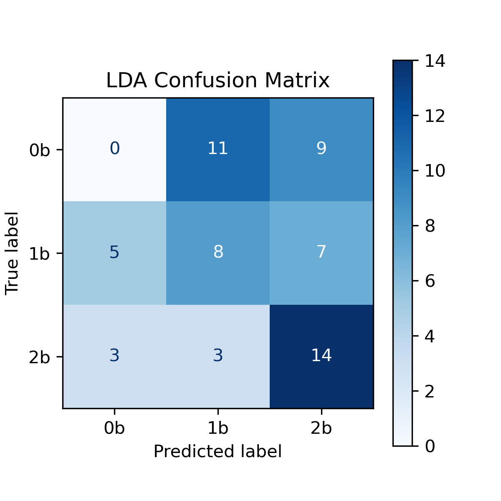

# 113-2｜BCI Project: EEG-based Working Memory Load Detection

## Introduction
Load Theory (Lavie, 2005) states that cognitive load affects perceptual processing and attention control strategies. The N-back task is widely used to simulate different working memory load conditions. Previous studies have shown that under high-load conditions (such as 2-back), compared with low-load conditions (such as 1-back), the subjects' frontal midline theta power increased significantly, while the amplitude of the P300 ERP component decreased (Cohen, 2014; Polich, 2007). These EEG indicators can be used as a basis for constructing classification models and predicting the user's cognitive state.

## Data Description

The dataset used in this study is from the **COG-BCI database** (Zenodo DOI: 10.5281/zenodo.7413650), released by the COG-BCI team. The original EEG recordings are stored in EEGLAB `.set/.fdt` format following a BIDS-compliant directory structure (e.g., `sub-01/ses-S1/zeroBack.set`, `oneBack.set`, `twoBack.set`). Behavioral data (reaction times, accuracy) and questionnaire responses (RSME, KSS) are included alongside the EEG/ECG files. The dataset consists of **29 healthy adult participants** (`sub-01` through `sub-29`), each undergoing **three sessions** (`ses-S1`, `ses-S2`, `ses-S3`). In each session, participants performed three working-memory load conditions: **0-back**, **1-back**, and **2-back**.

**Experimental Design / Data Collection Procedure**: A custom Python script presented sequences of digits (0–9) on a screen in random order. Participants judged whether the current stimulus matched the one presented *N* trials before (*N* = 0, 1, or 2). Each condition consisted of several blocks (\~50 trials per block). Every stimulus was marked with an event code, and EEG/ECG data were recorded simultaneously. Stimulus–response synchronization was handled by **LabStreamingLayer**.

**Hardware**: A **64-channel active Ag–AgCl electrode cap** (BioSemi ActiveTwo system, Brain Products GmbH) with ActiCap and ActiCHamp amplifier was used. Electrodes were positioned according to the extended 10–20 system. Additionally, channel 10 was placed at the left fifth intercostal space to record ECG. Due to technical issues, Cz was missing for participants 1–9 (actual EEG channels = 63).

**Software**: LabStreamingLayer facilitated stimulus synchronization. **MNE-Python** was used for data loading (`read_raw_eeglab`), filtering, ICA decomposition, and ICLabel classification. Artifact correction was performed with **AutoReject**. Statistical analyses utilized Python libraries (**pandas**, **pingouin**, **scikit-learn**, **seaborn**).

**Data Size**: Each recording file contains approximately 200,000 time points at a 500 Hz sampling rate (\~95 MB per file). With 29 participants × 3 sessions × 3 load conditions, there are **261** raw `.set/.fdt` files.

**Source**: Zenodo ([https://zenodo.org/records/7413650](https://zenodo.org/records/7413650)), publicly available under the COG-BCI team release.

---

## Quality Evaluation

We performed **Independent Component Analysis (extended-infomax)** combined with **ICLabel** classification on three preprocessing stages—**raw**, **1–40 Hz band-pass filtered**, and **1–40 Hz + artifact correction (ASR)**—to assess the reliability and credibility of the EEG data. The table below summarizes results for one example file (`sub-01/ses-S1/zeroBack`) with **30 independent components (ICs)** extracted by ICA under each preprocessing condition:

| Pre-processing Stage                      | Band-pass | ASR | Brain | Muscle Artifact | Eye | Heart | Line | Channel Noise | Other |
| ----------------------------------------- | :-------: | :-: | :---: | :-------------: | :-: | :---: | :--: | :-----------: | :---: |
| **Raw** (no filtering)                    |           |     |   1   |        0        |  0  |   0   |   0  |       0       |   24  |
| **Filtered** (1–40 Hz)                    |     ✓     |     |   12  |        0        |  0  |   0   |   0  |       0       |   6   |
| **Band-pass + Artifact Correction (ASR)** |     ✓     |  ✓  |   4   |        11       |  1  |   0   |   0  |       1       |   2   |

* **Raw Stage**: ICA extracted 30 ICs, but ICLabel identified only **1** as “brain source” and **24** as “other,” indicating extremely low signal-to-noise ratio without filtering, so most components could not be classified.
* **Band-Pass Stage (1–40 Hz)**: After applying a 1–40 Hz band-pass filter, ICA still yielded 30 ICs, but “brain source” ICs increased to **12**, showing that filtering successfully removed low-frequency drift and high-frequency muscle artifacts, improving differentiability of brain-related signals. The “other” category dropped to **6**.
* **Band-Pass + Artifact Correction (ASR)**: Using AutoReject to correct artifacts on the 1–40 Hz filtered data, ICA again produced 30 ICs. Of these, **4** were labeled “brain source,” while **11** were labeled “muscle artifact,” **1** labeled “channel noise,” and **2** labeled “other.” Artifact correction further reduced the “other” count but introduced high-frequency interpolation edges that ICLabel misclassified as muscle artifacts.

> **Note**: Although artifact correction (ASR-like) significantly reduces “other” ICs, it may also cause some true brain signals to be labeled as muscle artifacts due to high-frequency interpolation edges. Adjusting thresholds or applying notch filtering can help recover brain-source ICs.

**Overall**, these ICA + ICLabel results confirm that **1–40 Hz filtering** yields the highest proportion of brain-source ICs, making it optimal for subsequent ERP (P300) and frequency-domain (theta power) feature extraction. Artifact correction can further reduce unclassified components but must be applied carefully to avoid over-interpolating and creating false muscle artifacts.

---

## Model Framework

**Overview**: We implemented a four-stage pipeline for detecting working-memory load from EEG:

1. **Preprocessing**: Raw → ICA+ICLabel → Clean → Band-pass → Epoch
2. **Feature Extraction**: P300 (300–500 ms @ Cz/Pz) and theta power (4–7 Hz @ Fz/FCz/Pz) for each trial
3. **Statistical Analysis**: Repeated-measures ANOVA and pairwise t-tests to validate feature sensitivity
4. **Classification**: 10-fold cross-validation with LDA and SVM to predict load condition (0/1/2-back)


*Figure: High-level pipeline of EEG preprocessing, feature extraction, statistical validation, and classification.*

**Preprocessing Details**:

* **Step 1: Raw → 1–100 Hz Band-pass → ICA + ICLabel**

  * Remove ECG channel (if present), re-reference to average, and apply a 1–100 Hz band-pass filter.
  * Perform extended-infomax ICA and label each component with ICLabel.
  * Exclude all non-“brain” ICs, reconstruct cleaned EEG.
* **Step 2: Cleaned EEG → 1–40 Hz Band-pass → Epoching**

  * Further apply a 1–40 Hz band-pass filter to cleaned data.
  * Use event codes to segment epochs (−200 to 800 ms) around each stimulus.

**Quality Evaluation**:

* Compared ICLabel counts across three preprocessing stages (Raw, Filtered, Filtered+ASR) to ensure data reliability.
* Identified that 1–40 Hz band-pass filtering maximizes brain-source ICs, while ASR reduces “other” but may introduce misclassified muscle artifacts.

---

## Feature Extraction

**ERP (P300) Extraction**:

1. Read epochs (`sub-XX_ses-SX_[0b/1b/2b]-epo.fif`) from `data/preproc/`.
2. For each epoch, compute baseline-corrected average voltage in the **300–500 ms** window at channels **Cz** and **Pz**.
3. Take the mean of Cz and Pz amplitudes as the trial-level P300 feature.

```python
# Example P300 extraction (pseudocode)
def extract_p300(epochs, channels=['Cz','Pz'], tmin=0.3, tmax=0.5):
    data = epochs.get_data(picks=channels)  # shape = (n_trials, 2, n_times)
    times = epochs.times
    idx_min = np.argmin(np.abs(times - tmin))
    idx_max = np.argmin(np.abs(times - tmax))
    return data[:,:,idx_min:idx_max].mean(axis=2).mean(axis=1)  # (n_trials,)
```

**Theta Power Extraction**:

1. For each epoch, compute power spectral density (PSD) using Welch’s method between **4–7 Hz** at channels **Fz**, **FCz**, and **Pz**.
2. Average PSD values across the 4–7 Hz band for each channel, and then take the mean across Fz/FCz/Pz as the trial-level theta feature.

```python
# Example theta extraction (pseudocode)
def extract_theta_power(epochs, channels=['Fz','FCz','Pz'], fmin=4, fmax=7):
    psd_epochs = epochs.pick_channels(channels).compute_psd(method='welch', fmin=fmin, fmax=fmax)
    psds = psd_epochs.get_data()  # shape = (n_trials, len(channels), n_freqs)
    return psds.mean(axis=2).mean(axis=1)  # (n_trials,)
```

**Aggregating Features**:

* Concatenate P300 and theta features for each trial into a single DataFrame with columns: `sub`, `ses`, `cond` (0b/1b/2b), `trial`, `p300_mean`, `theta_mean`.
* Save as `results/features_all.csv` with \~29×3×(trials per block) rows.

---

## Statistical Analysis

**Goal**: Validate whether P300 amplitude and theta power vary significantly across load conditions (0/1/2-back).

1. **Aggregate**: Compute each subject’s **mean P300** and **mean theta** for each condition (0/1/2-back).
2. **Repeated-Measures ANOVA** (pingouin):

   * `rm_anova(dv='p300_mean', within='load', subject='sub', data=agg_df)`
   * `rm_anova(dv='theta_mean', within='load', subject='sub', data=agg_df)`
3. **Post-hoc Pairwise t-tests**

   * `pairwise_tests(dv='p300_mean', within='load', subject='sub', data=agg_df, padjust='bonf')`
   * `pairwise_tests(dv='theta_mean', within='load', subject='sub', data=agg_df, padjust='bonf')`
4. **Effect Size**: Report partial η² (ANOVA) and Cohen’s *d* (paired t-tests).

**Example Results (P300)**:

* **ANOVA**: F(2,38)=9.88, p=0.00035, η²ₚ=0.092
* **Pairwise (Bonferroni)**: 0 vs 2: p<0.05, d=0.63; 1 vs 2: p<0.01, d=0.91

**Example Results (Theta)**:

* **ANOVA**: F(2,38)=0.29, p=0.75 (ns)
* **Pairwise**: all pₙₛ

Plots:

* Boxplots or bar plots of mean P300 and mean theta by load, with error bars (95% CI).

---

## Classification

**Objective**: Predict working-memory load (0/1/2-back) using trial-level P300 and theta features.

1. **Data Preparation**:

   * Aggregate subject-level means: each row = one subject & one condition (0/1/2), columns = `p300_mean`, `theta_mean`.
   * `X = [[p300_mean, theta_mean]]`, `y = load` (0/1/2).
2. **10-Fold Stratified CV**:

   * Use `StratifiedKFold(n_splits=10, shuffle=True, random_state=42)`.
3. **Models**:

   * **LDA**: `Pipeline([('scaler', StandardScaler()), ('clf', LinearDiscriminantAnalysis())])`
   * **SVM** (linear): `Pipeline([('scaler', StandardScaler()), ('clf', SVC(kernel='linear'))])`
4. **Metrics**: Accuracy and weighted F1-score for each fold; report mean ± std.
5. **Confusion Matrix**: Use `cross_val_predict` to get predicted labels across all folds, and display with `ConfusionMatrixDisplay`.
6. **Save Results**: Write a CSV (`results/classification_report.csv`) with columns: `Model`, `Accuracy Mean`, `Accuracy Std`, `F1 Mean`, `F1 Std`.

**Expected Performance**:

* LDA: \~0.50–0.60 accuracy, SVM: \~0.50–0.65 accuracy in cross-subject 3-class setting.

---

## Usage

1. **Clone Repository**:

   ```bash
   git clone https://github.com/YourUsername/113-2BCI_FinalProject.git
   cd 113-2BCI_FinalProject
   ```
2. **Install Environment**:

   ```bash
   conda create -n bci_env python=3.9 -y
   conda activate bci_env
   pip install -r requirements.txt
   ```

   * **requirements.txt** should list: `mne`, `mne-icalabel`, `autoreject`, `asrpy`, `pandas`, `numpy`, `scikit-learn`, `pingouin`, `seaborn`, `matplotlib`
3. **Download Raw Data**:

   * From Zenodo ([https://zenodo.org/records/7413650](https://zenodo.org/records/7413650)), download and extract into `data/raw/` so that `data/raw/sub-01/ses-S1/0-back.set` etc. are accessible.
4. **Run Notebooks in Order**:

   * `notebooks/01_preprocess.ipynb` (produce cleaned epochs in `data/preproc/`, save `ICLabel_counts_all.csv`)
   * `notebooks/02_feature_extraction.ipynb` (generate `results/features_all.csv`)
   * `notebooks/03_statistics.ipynb` (run ANOVA & t-tests, save `results/stats_summary.csv`)
   * `notebooks/04_classification.ipynb` (run 10-fold CV, save `results/classification_report.csv`, `results/y_true.npy`, `results/y_pred_lda.npy`)
   * `notebooks/05_visualization_demo.ipynb` (generate figures in `figures/`)
5. **View Results**:

   * Check `results/` for CSV summaries and `figures/` for plots (ERP overlay, theta barplot, ICLabel comparison, confusion matrix).


## Results

### 1. ERP (P300) Findings

Figure 1 shows the grand‐average ERP waveforms at **Pz** for the three load conditions (0-back, 1-back, 2-back). The shaded region (300–500 ms) marks the P300 window used for amplitude measurement. Qualitatively, you can see that as memory load increases, the P300 voltage peak in this window becomes smaller (green < orange < blue).



**Figure 1.** Grand‐average ERP at Pz for 0-back (blue), 1-back (orange), and 2-back (green). The gray shaded region (300–500 ms) indicates the P300 measurement window.

#### P300 Repeated‐Measures ANOVA

A repeated‐measures ANOVA was conducted on each subject’s mean P300 amplitude across the three load conditions. Statistics (using Pingouin) were as follows:

```
Source   SS             DF   MS             F        p-unc    η²ₚ    ε
load   2.3593e-12       2  1.1796e-12     9.8819   0.00035   0.0923  0.7554
Error  4.5361e-12      38  1.1937e-13       —        —        —       —
```

* **F(2, 38) = 9.882, p = 0.00035, η²ₚ = 0.0923**
  This indicates a highly significant main effect of load on P300 amplitude.

#### P300 Pairwise Comparisons (Bonferroni)

Post-hoc paired t-tests (Bonferroni‐corrected) were performed between each pair of load conditions:

| Comparison |    t    |  p-unc | p-corr | Cohen’s d |
| :--------: | :-----: | :----: | :----: | :-------: |
|   0 vs 1   | –1.1465 | 0.2658 | 0.7974 |   –0.26   |
|   0 vs 2   |  2.8015 | 0.0114 | 0.0342 |    0.63   |
|   1 vs 2   |  4.0782 | 0.0006 | 0.0019 |    0.91   |

* **0 vs 2-back**: t(19) = 2.8015, p\_unc = 0.0114, p\_corr = 0.0342 (p < 0.05), Cohen’s d = 0.63
* **1 vs 2-back**: t(19) = 4.0782, p\_unc = 0.0006, p\_corr = 0.0019 (p < 0.01), Cohen’s d = 0.91
* **0 vs 1-back**: not significant (p\_corr = 0.7974)

Thus, P300 amplitude in 2-back is significantly lower than in both 0- and 1-back, while 0-back vs 1-back shows no reliable difference.

---

### 2. Theta Power Findings

Figure 2 shows the mean theta (4–7 Hz) power (µV²) averaged across channels Fz, FCz, and Pz for each load condition. Although there is a slight visual trend (1-back > 2-back > 0-back), no statistical difference was found.



**Figure 2.** Mean theta power (4–7 Hz) by load (0-back, 1-back, 2-back). Error bars represent ±1 SEM.

#### Theta Repeated‐Measures ANOVA

A repeated‐measures ANOVA on each subject’s mean theta power yielded:

```
Source   SS                DF   MS             F       p-unc    η²ₚ    ε
load   2.7558e-26          2  1.3779e-26    0.2908  0.7493   0.0014  0.8380
Error  1.8008e-24         38  4.7389e-26       —       —        —       —
```

* **F(2, 38) = 0.2908, p = 0.7493, η²ₚ = 0.0014**
  This indicates no significant main effect of load on theta power.

#### Theta Pairwise Comparisons (Bonferroni)

Post-hoc paired t-tests (Bonferroni‐corrected):

| Comparison |    t    |  p-unc | p-corr |
| :--------: | :-----: | :----: | :----: |
|   0 vs 1   | –0.9303 | 0.3639 | 1.0000 |
|   0 vs 2   | –0.2578 | 0.7993 | 1.0000 |
|   1 vs 2   |  0.4700 | 0.6437 | 1.0000 |

All comparisons are non-significant (p\_corr = 1.0).

---

### 3. Classification Results

Table 1 summarizes the 10-fold cross-validated performance for **LDA** and **SVM (linear kernel)**, using each subject’s mean P300 and theta features (one row per load condition per subject).

| Model | Accuracy (mean ± SD) | Weighted F1 (mean ± SD) |
| :---: | :------------------: | :---------------------: |
|  LDA  |    0.3667 ± 0.1795   |     0.2946 ± 0.1631     |
|  SVM  |    0.3667 ± 0.1795   |     0.2857 ± 0.1594     |

**Table 1.** 10-fold stratified CV classification performance (3-class: 0/1/2-back).

* Both LDA and SVM achieve a mean accuracy of **36.7 %** (±17.95 %) and a weighted F1 of \~0.29.
* The relatively low accuracy reflects the challenge of discriminating three load levels across subjects using only two features (P300, theta power).

Figure 3 shows the confusion matrix for **LDA** predictions (aggregated over all folds). The true class labels (rows) vs. predicted labels (columns) are coded as 0 = 0-back, 1 = 1-back, 2 = 2-back.



**Figure 3.** LDA confusion matrix (aggregated over all 10 folds).

* 0-back trials (row 0) were most often misclassified as 1-back (11/20) or 2-back (9/20).
* 1-back trials (row 1) were split: 8 correctly labeled, but 5 labeled as 0-back and 7 as 2-back.
* 2-back trials (row 2) achieved the highest correct rate (14/20), with a few mislabeled as 0-back (3/20) or 1-back (3/20).

This pattern indicates that the model is better at identifying high load (2-back) but struggles to separate low vs. moderate load (0- vs 1-back), consistent with the overlapping feature distributions.

---

**Summary of Results**

1. **ERP (P300)**

   * Significant decrease in P300 amplitude as load increases, especially between 2-back and both 0-back/1-back.
   * No significant difference between 0-back and 1-back.
2. **Theta Power**

   * No significant change across load conditions.
3. **Classification**

   * Using P300 + theta, LDA and SVM achieve \~36.7 % accuracy for three-class cross-subject CV.
   * Confusion matrix shows best performance at identifying 2-back, with frequent confusion between 0- and 1-back.

These findings confirm that **P300 amplitude** is a robust index of working‐memory load, whereas **theta power** did not reliably differentiate among 0/1/2-back in this dataset. The modest classification accuracy underscores the need for additional features or more advanced algorithms to improve between‐load discrimination.

